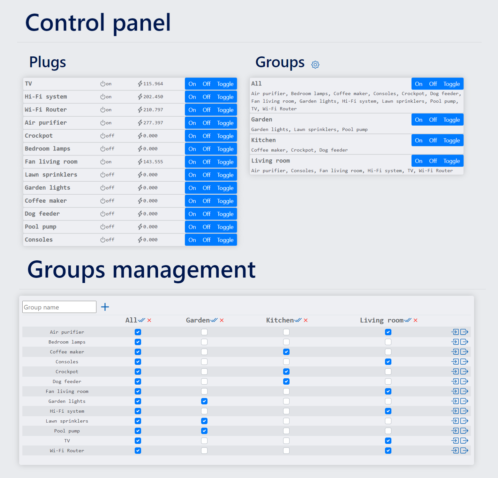
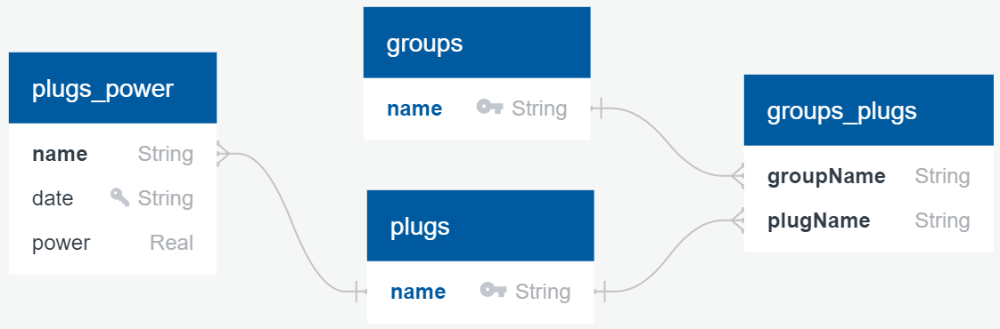

<h1 align = "center"> IoT Hub </h1>

[![MIT License][license-shield]][license-url]
[![LinkedIn][linkedin-shield]][linkedin-url]

<p align="center">
    
</p>

Deploy a server connected to an MQTT broker to control your Internet-of-Things devices through a Web App including, GUI, RESTful API, and an SQL database! Built with [Spring Boot](https://github.com/spring-projects/spring-boot), [Bootstrap 4](https://github.com/twbs/bootstrap), [Eclipse Paho Java Client](https://github.com/eclipse/paho.mqtt.java), and [SQLite JDBC Driver](https://github.com/xerial/sqlite-jdbc).

- [Getting Started](#getting-started)
  - [Prerequisites](#prerequisites)
  - [Installation](#installation)
  - [Launch the IoT-Hub](#launch-the-iot-hub)
  - [GUI video presentation](#gui-video-presentation)
- [Usage](#usage)
  - [Simulated plugs control](#simulated-plugs-control)
  - [MQTT messages](#mqtt-messages)
  - [RESTful API](#restful-api)
  - [User interface](#user-interface)
  - [Database](#database)
- [License](#license)
- [Tests coverage](#tests-coverage)
  - [iot_hub](#iot_hub)
  - [iot_sim](#iot_sim)

## Getting Started

To get a local copy up and running follow these simple steps.

### Prerequisites

* Java JDK 8+
* Gradle 7+
* An MQTT broker, deploy the following docker container if unsure:
    ```sh
    docker pull eclipse-mosquitto:1.6.14
    docker run -it -p 1883:1883 eclipse-mosquitto:1.6.14
    ```

### Installation

You need an MQTT broker running on port `tcp://127.0.0.1:1883` to execute installation tests. 

1. Clone the repo.
   ```sh
   git clone https://github.com/ArthurFDLR/IoT_hub.git
   cd .\IoT_hub\
   ```
2. Run unitary tests and build the app.
   ```sh
   gradle
   ```
3. Run integration tests to verify installation, it may take some time.
   ```sh
   gradle test_integration
   ```

### Launch the IoT-Hub

1. Configure your IoT-Hub in [`./hubConfig.json`](./hubConfig.json):
   * `httpPort`: port on which the web-app and the RESTful API can be accessed.
   * `mqttBroker`: Address of your MQTT broker, should be `tcp://127.0.0.1:1883` if you followed the [prerequisites](#prerequisites) MQTT installation.
   * `mqttClientId`: Client ID used by the hub to connect to the broker.
   * `mqttTopicPrefix`: Prefix of all MQTT topics used by the web app.
   * `databaseFileName`: Name of the SQLite database for your hub.
2. Start the hub
   ```sh
   gradle iot_hub
   ```
3. You can simulate smart plugs to populate the MQTT server if you don't have any IoT devices connected. Configure the simulator in [`./simConfig.json`](./simConfig.json):
   * `httpPort`: port on which the simulated plugs can be controlled. It must be different from the port of the main web app.
   * `plugNames`: List of names of simulated plugs.
   * `mqttBroker`: Address of your MQTT broker.
   * `mqttClientId`: Client ID used by the simulator to connect to the broker.
   * `mqttTopicPrefix`: Prefix of all MQTT topics used by the simulator. It must be the same as the one used by the web app.

### [GUI video presentation](https://youtu.be/wKBkg99ltxM)

<!-- USAGE EXAMPLES -->
## Usage

### Simulated plugs control

* **Plug report:**
  I want to access the web page containing a report of the plug with the name `plugName` at the path `/plugName` without any query string, so that I can view the report using a browser. The report should include whether the switch is on and its power reading.

* **Toggle or switch a plug on/off:**
  As an end-user, I want to control the plug with the name `plugName` at the path `/plugName` with a query string, so that I can control the plug using a browser. To toggle a plug, the query string is `action=toggle`. To switch a plug on, the query string is `action=on`. To switch a plug off, the query string is `action=off`.

* **Control feedback:**
    As an end-user, I want to receive the up-to-date report as the response to the path `/plugName` with a query string, so that I can verify that the plug acts properly.

### MQTT messages

* **Plug on/off updates:**
    As an end-user, I want to receive MQTT messages when a plug is turned on or off, so that I can monitor the plug on/off events using a MQTT client. For a plug with the name `plugName` and a configuration string `prefix`, the topic should be `prefix/update/plugName/state`, and the message is either `on` or `off`. Note that it is possible for prefix to have the character / multiple times.

* **Plug power updates:**
    As an end-user, I want to receive MQTT messages when the power consumption of a plug is measured, so that I can monitor the plug power consumption using a MQTT client. For a plug with the name `plugName` and a configuration string `prefix`, the topic should be `prefix/update/plugName/power`, and the message is the power consumption in plain text.

* **Toggle or switch a plug on/off:**
    As an end-user, I want to send MQTT messages to toggle or switch on/off a plug, so that I can control the plug using a MQTT client. For a plug with the name `plugName` and a configuration string `prefix`, the topic should be `prefix/action/plugName/actionString`, where the actionString is one of `toggle`, `on`, or `off`.

### RESTful API

* **Get the state of a single plug:**
    As an end-user, I want to query the state of the plug `plugName` via a GET request to `/api/plugs/plugName`, so that I can obtain state of individual plugs in a web application. The response should be a JSON object in the format, e.g. `{"name":"plugName", "state":"on", "power":100}`. The value for `state` could also be `off`.

* **Get the states of all plugs:**
    As an end-user, I want to query the states of all plugs via a GET request to `/api/plugs`, so that I can obtain all of them at once in a web application. The response should be a JSON array of objects, that each represents the state of a single plug.

* **Control a single plug:**
    As an end-user, I want to switch on/off or toggle the plug `plugName` via a GET request to `/api/plugs/plugName` with a query string, so that I can control it in a web application. To toggle the plug, the query string is `action=toggle`. To switch the plug on, the query string is `action=on`. To switch the plug off, the query string is `action=off`.

* **Create a group:**
    As an end-user, I want to create a group `groupName` of plugs via a POST request to `/api/groups/groupName`, so that I can manage multiple plugs as a whole. The body of the POST request is a JSON array of the names of the plugs to be included in the group. If the group already exists, its members will all be replaced. Note that a single plug is allowed to be assigned to multiple groups.

* **Remove a group:**
    As an end-user, I want to remove a group `groupName` of plugs via a DELETE request to `/api/groups/groupName`, so that I can remove the group in a web application.

* **State of a group:**
    As an end-user, I want to query the state of a group `groupName` as the states of its member plugs via a GET request to `/api/groups/groupName`, so that I can obtain their states in a web application. The response should be a JSON object with keys `name` for the name of the group, and “members” for a JSON array of objects, that each represents the state of a member plug.

* **States of all groups:**
    As an end-user, I want to query all the groups for the states of member plugs via a GET request to `/api/groups`, so that I can obtain everything together in a web application. The response should be a JSON array of objects, that each represents the state of a group.

* **Control a group:**
    As an end-user, I want to switch on/off or toggle all the plugs in a group `groupName` via a GET request to `/api/groups/groupName` with a query string, so that I can control plugs in a group together. The query string is the same as those to control a single plug.

### User interface

* **Plugs and plug states:**
    As an end-user, I want to see available plugs and their states, so
    that I can know what plugs are there and whether they are on or off.
    
    1.  Open a browser and access the root page. The names of all
        available plugs will show in rows on the left part of the page
        under *Plugs*.
    
    2.  The state of a plug is shown next to the *on/off* icon in the
        row associated to the plug.

* **Control a single plug:**
    As an end-user, I want to click a button on the web page to switch
    on/off or toggle a plug of my choice, so that I can easily control
    it.
    
    1.  Open a browser and access the root page. The names of all
        available plugs will show in rows on the left part of the page
        under *Plugs*.
    
    2.  A group of three buttons (*on*, *off*, and *toggle*) is
        available on the right side of each plug’s row.
    
    3.  Change the state of the plug accordingly by clicking these
        buttons.

* **Groups and plugs:**
    As an end-user, I want to see available groups, as well as plugs
    belong to a group of my choice and their states, so that I can know
    what groups have been defined, and the state of a group.
    
    1.  Open a browser and access the root page. The names of all
        available groups will show in rows on the right part of the page
        under *Groups*.
    
    2.  In each row, the name of the plugs composing the group are
        listed. If no groups are available, follow *Group management* to
        add a group.
    
    3.  Refer to *Plugs and plug states* to see the state of each plug.

* **Group management:**
    As an end-user, I want to add groups and modify their members on the
    web page, so that I can easily manage them.
    
    1.  Open a browser and access the root page. Access a group
        management page by clicking the *gear* icon next to *Groups* on
        the right part of the page.
    
    2.  Name a new group by typing in the text-input field at the
        top-left corner of the window.
    
    3.  Create the group by clicking the adjacent *+* icon. The group is
        added to a table underneath.
    
    4.  Populate this group by clicking on the checkbox at the
        intersection of the column of the group and the row of the
        targeted plug.
    
    5.  Follow *Groups and plugs* to verify that the group has been
        created.

* **Control plugs in a group:**
    As an end-user, I want to click a button on a web page to switch
    on/off or toggle all plugs belong to a group of my choice, so that I
    can easily control them together.
    
    1.  Open a browser and access the root page. The names of all
        available groups will show in rows on the right part of the page
        under *Groups*.
    
    2.  If no groups are available, follow *Group management* to create
        a group.
    
    3.  A group of three buttons (*on*, *off*, and *toggle*) is
        available on the right side of each row.
    
    4.  Change the state of the associated plug by clicking these
        buttons.

* **Multi-user synchronization:** 
    As an end-user, I want to see the state update for plugs in all
    places if someone else switch on/off or toggle plugs from another
    browser, so that multiple users can use the web application
    together.
    
    1.  Open two browser windows and access the root page on both of
        them.
    
    2.  Change the state of a plug on one of the pages by following
        *Control a single plug*.
    
    3.  The new state of the plug is now updated on both pages.

### Database

You can find the SQLite database files generated by the application in `./data/`. The name of the main database is defined in [`./hubConfig.json`](./hubConfig.json) (see [**Launch the IoT-Hub**](#launch-the-iot-hub)). As shown in the SQL schema below, groups, their members, and the power consumption of plugs are stored. You can access the database using an SQLite explorer such as the [SQLite VSC extension](https://marketplace.visualstudio.com/items?itemName=alexcvzz.vscode-sqlite).

<p align="center">
    
</p>

<!-- LICENSE -->
## License

Distributed under the MIT License. See `LICENSE` for more information.

## Tests coverage

<table>
    <thead><tr>
        <th>Package</th>
        <th>Tests</th>
        <th>Failures</th>
        <th>Ignored</th>
        <th>Duration</th>
        <th>Success rate</th>
    </tr></thead>
    <tbody>
        <tr>
            <td class="success">iot_hub</td>
            <td>19</td>
            <td>0</td>
            <td>0</td>
            <td>6.624s</td>
            <td class="success">100%</td>
        </tr>
        <tr>
            <td class="success">iot_sim</td>
            <td>33</td>
            <td>0</td>
            <td>0</td>
            <td>0.038s</td>
            <td class="success">100%</td>
        </tr>
    </tbody>
</table>

### iot_hub

<table class="coverage" cellspacing="0" id="coveragetable">
   <thead>
      <tr>
         <th>Element</th>
         <th>Missed Instructions</th>
         <th>Cov.</th>
         <th>Missed Branches</th>
         <th>Cov.</th>
         <th>Missed</th>
         <th>Cxty</th>
         <th>Missed</th>
         <th>Lines</th>
         <th>Missed</th>
         <th>Methods</th>
         <th>Missed</th>
         <th>Classes</th>
      </tr>
   </thead>
   <tfoot>
      <tr>
         <td>Total</td>
         <td class="bar">382 of 1,056</td>
         <td class="ctr2">63%</td>
         <td class="bar">11 of 37</td>
         <td class="ctr2">70%</td>
         <td class="ctr1">22</td>
         <td class="ctr2">68</td>
         <td class="ctr1">70</td>
         <td class="ctr2">227</td>
         <td class="ctr1">16</td>
         <td class="ctr2">49</td>
         <td class="ctr1">3</td>
         <td class="ctr2">8</td>
      </tr>
   </tfoot>
   <tbody>
      <tr>
         <td id="a1">DatabaseController</td>
         <td class="bar" id="b0"></td>
         <td class="ctr2" id="c4">60%</td>
         <td class="bar" id="d0"></td>
         <td class="ctr2" id="e4">50%</td>
         <td class="ctr1" id="f1">5</td>
         <td class="ctr2" id="g0">15</td>
         <td class="ctr1" id="h0">23</td>
         <td class="ctr2" id="i0">91</td>
         <td class="ctr1" id="j3">2</td>
         <td class="ctr2" id="k1">9</td>
         <td class="ctr1" id="l3">0</td>
         <td class="ctr2" id="m0">1</td>
      </tr>
      <tr>
         <td id="a5">Main</td>
         <td class="bar" id="b1"></td>
         <td class="ctr2" id="c5">0%</td>
         <td class="bar" id="d1"></td>
         <td class="ctr2" id="e5">0%</td>
         <td class="ctr1" id="f2">5</td>
         <td class="ctr2" id="g5">5</td>
         <td class="ctr1" id="h1">20</td>
         <td class="ctr2" id="i3">20</td>
         <td class="ctr1" id="j1">4</td>
         <td class="ctr2" id="k5">4</td>
         <td class="ctr1" id="l0">1</td>
         <td class="ctr2" id="m1">1</td>
      </tr>
      <tr>
         <td id="a0">App</td>
         <td class="bar" id="b2"></td>
         <td class="ctr2" id="c6">0%</td>
         <td class="bar" id="d2"></td>
         <td class="ctr2" id="e6">0%</td>
         <td class="ctr1" id="f3">5</td>
         <td class="ctr2" id="g6">5</td>
         <td class="ctr1" id="h2">14</td>
         <td class="ctr2" id="i5">14</td>
         <td class="ctr1" id="j2">4</td>
         <td class="ctr2" id="k6">4</td>
         <td class="ctr1" id="l1">1</td>
         <td class="ctr2" id="m2">1</td>
      </tr>
      <tr>
         <td id="a4">HubConfig</td>
         <td class="bar" id="b3"></td>
         <td class="ctr2" id="c7">0%</td>
         <td class="bar" id="d7"/>
         <td class="ctr2" id="e7">n/a</td>
         <td class="ctr1" id="f0">6</td>
         <td class="ctr2" id="g4">6</td>
         <td class="ctr1" id="h3">12</td>
         <td class="ctr2" id="i6">12</td>
         <td class="ctr1" id="j0">6</td>
         <td class="ctr2" id="k3">6</td>
         <td class="ctr1" id="l2">1</td>
         <td class="ctr2" id="m3">1</td>
      </tr>
      <tr>
         <td id="a6">PlugsModel</td>
         <td class="bar" id="b4"></td>
         <td class="ctr2" id="c3">94%</td>
         <td class="bar" id="d3"></td>
         <td class="ctr2" id="e3">88%</td>
         <td class="ctr1" id="f4">1</td>
         <td class="ctr2" id="g1">15</td>
         <td class="ctr1" id="h4">1</td>
         <td class="ctr2" id="i1">39</td>
         <td class="ctr1" id="j4">0</td>
         <td class="ctr2" id="k0">10</td>
         <td class="ctr1" id="l4">0</td>
         <td class="ctr2" id="m4">1</td>
      </tr>
      <tr>
         <td id="a2">GroupsModel</td>
         <td class="bar" id="b5"></td>
         <td class="ctr2" id="c0">100%</td>
         <td class="bar" id="d4"></td>
         <td class="ctr2" id="e0">100%</td>
         <td class="ctr1" id="f5">0</td>
         <td class="ctr2" id="g2">9</td>
         <td class="ctr1" id="h5">0</td>
         <td class="ctr2" id="i2">23</td>
         <td class="ctr1" id="j5">0</td>
         <td class="ctr2" id="k2">7</td>
         <td class="ctr1" id="l5">0</td>
         <td class="ctr2" id="m5">1</td>
      </tr>
      <tr>
         <td id="a3">GroupsResource</td>
         <td class="bar" id="b6"></td>
         <td class="ctr2" id="c1">100%</td>
         <td class="bar" id="d5"></td>
         <td class="ctr2" id="e1">100%</td>
         <td class="ctr1" id="f6">0</td>
         <td class="ctr2" id="g3">8</td>
         <td class="ctr1" id="h6">0</td>
         <td class="ctr2" id="i4">17</td>
         <td class="ctr1" id="j6">0</td>
         <td class="ctr2" id="k4">6</td>
         <td class="ctr1" id="l6">0</td>
         <td class="ctr2" id="m6">1</td>
      </tr>
      <tr>
         <td id="a7">PlugsResource</td>
         <td class="bar" id="b7"></td>
         <td class="ctr2" id="c2">100%</td>
         <td class="bar" id="d6"></td>
         <td class="ctr2" id="e2">100%</td>
         <td class="ctr1" id="f7">0</td>
         <td class="ctr2" id="g7">5</td>
         <td class="ctr1" id="h7">0</td>
         <td class="ctr2" id="i7">11</td>
         <td class="ctr1" id="j7">0</td>
         <td class="ctr2" id="k7">3</td>
         <td class="ctr1" id="l7">0</td>
         <td class="ctr2" id="m7">1</td>
      </tr>
   </tbody>
</table>

### iot_sim

<table class="coverage" cellspacing="0" id="coveragetable">
   <thead>
      <tr>
         <th>Element</th>
         <th>Missed Instructions</th>
         <th>Cov.</th>
         <th>Missed Branches</th>
         <th>Cov.</th>
         <th>Missed</th>
         <th>Cxty</th>
         <th>Missed</th>
         <th>Lines</th>
         <th>Missed</th>
         <th>Methods</th>
         <th>Missed</th>
         <th>Classes</th>
      </tr>
   </thead>
   <tfoot>
      <tr>
         <td>Total</td>
         <td class="bar">287 of 826</td>
         <td class="ctr2">65%</td>
         <td class="bar">8 of 52</td>
         <td class="ctr2">84%</td>
         <td class="ctr1">21</td>
         <td class="ctr2">69</td>
         <td class="ctr1">68</td>
         <td class="ctr2">177</td>
         <td class="ctr1">17</td>
         <td class="ctr2">41</td>
         <td class="ctr1">3</td>
         <td class="ctr2">7</td>
      </tr>
   </tfoot>
   <tbody>
      <tr>
         <td id="a1">Main</td>
         <td class="bar" id="b0"></td>
         <td class="ctr2" id="c4">0%</td>
         <td class="bar" id="d0"></td>
         <td class="ctr2" id="e3">0%</td>
         <td class="ctr1" id="f0">9</td>
         <td class="ctr2" id="g3">9</td>
         <td class="ctr1" id="h0">36</td>
         <td class="ctr2" id="i2">36</td>
         <td class="ctr1" id="j0">6</td>
         <td class="ctr2" id="k1">6</td>
         <td class="ctr1" id="l0">1</td>
         <td class="ctr2" id="m0">1</td>
      </tr>
      <tr>
         <td id="a2">MeasurePower</td>
         <td class="bar" id="b1"></td>
         <td class="ctr2" id="c5">0%</td>
         <td class="bar" id="d1"></td>
         <td class="ctr2" id="e4">0%</td>
         <td class="ctr1" id="f1">6</td>
         <td class="ctr2" id="g4">6</td>
         <td class="ctr1" id="h1">20</td>
         <td class="ctr2" id="i4">20</td>
         <td class="ctr1" id="j2">5</td>
         <td class="ctr2" id="k3">5</td>
         <td class="ctr1" id="l1">1</td>
         <td class="ctr2" id="m1">1</td>
      </tr>
      <tr>
         <td id="a6">SimConfig</td>
         <td class="bar" id="b2"></td>
         <td class="ctr2" id="c6">0%</td>
         <td class="bar" id="d5"/>
         <td class="ctr2" id="e5">n/a</td>
         <td class="ctr1" id="f2">6</td>
         <td class="ctr2" id="g5">6</td>
         <td class="ctr1" id="h2">12</td>
         <td class="ctr2" id="i5">12</td>
         <td class="ctr1" id="j1">6</td>
         <td class="ctr2" id="k2">6</td>
         <td class="ctr1" id="l2">1</td>
         <td class="ctr2" id="m2">1</td>
      </tr>
      <tr>
         <td id="a5">PlugSim</td>
         <td class="bar" id="b3"></td>
         <td class="ctr2" id="c0">100%</td>
         <td class="bar" id="d3"></td>
         <td class="ctr2" id="e0">100%</td>
         <td class="ctr1" id="f3">0</td>
         <td class="ctr2" id="g0">20</td>
         <td class="ctr1" id="h3">0</td>
         <td class="ctr2" id="i0">43</td>
         <td class="ctr1" id="j3">0</td>
         <td class="ctr2" id="k0">12</td>
         <td class="ctr1" id="l3">0</td>
         <td class="ctr2" id="m3">1</td>
      </tr>
      <tr>
         <td id="a0">HTTPCommands</td>
         <td class="bar" id="b4"></td>
         <td class="ctr2" id="c1">100%</td>
         <td class="bar" id="d2"></td>
         <td class="ctr2" id="e1">100%</td>
         <td class="ctr1" id="f4">0</td>
         <td class="ctr2" id="g1">15</td>
         <td class="ctr1" id="h4">0</td>
         <td class="ctr2" id="i1">38</td>
         <td class="ctr1" id="j4">0</td>
         <td class="ctr2" id="k4">5</td>
         <td class="ctr1" id="l4">0</td>
         <td class="ctr2" id="m4">1</td>
      </tr>
      <tr>
         <td id="a3">MQTTCommands</td>
         <td class="bar" id="b5"></td>
         <td class="ctr2" id="c2">100%</td>
         <td class="bar" id="d4"></td>
         <td class="ctr2" id="e2">100%</td>
         <td class="ctr1" id="f5">0</td>
         <td class="ctr2" id="g2">10</td>
         <td class="ctr1" id="h5">0</td>
         <td class="ctr2" id="i3">21</td>
         <td class="ctr1" id="j5">0</td>
         <td class="ctr2" id="k5">4</td>
         <td class="ctr1" id="l5">0</td>
         <td class="ctr2" id="m5">1</td>
      </tr>
      <tr>
         <td id="a4">MQTTUpdates</td>
         <td class="bar" id="b6"></td>
         <td class="ctr2" id="c3">100%</td>
         <td class="bar" id="d6"/>
         <td class="ctr2" id="e6">n/a</td>
         <td class="ctr1" id="f6">0</td>
         <td class="ctr2" id="g6">3</td>
         <td class="ctr1" id="h6">0</td>
         <td class="ctr2" id="i6">7</td>
         <td class="ctr1" id="j6">0</td>
         <td class="ctr2" id="k6">3</td>
         <td class="ctr1" id="l6">0</td>
         <td class="ctr2" id="m6">1</td>
      </tr>
   </tbody>
</table>

<!-- MARKDOWN LINKS & IMAGES -->
[license-shield]: https://img.shields.io/github/license/ArthurFDLR/IoT_hub?style=for-the-badge
[license-url]: https://github.com/ArthurFDLR/IoT_hub/blob/master/LICENSE
[linkedin-shield]: https://img.shields.io/badge/-LinkedIn-black.svg?style=for-the-badge&logo=linkedin&colorB=555
[linkedin-url]: https://linkedin.com/in/arthurfdlr/