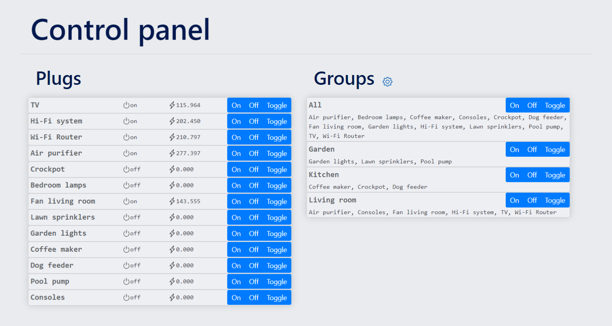
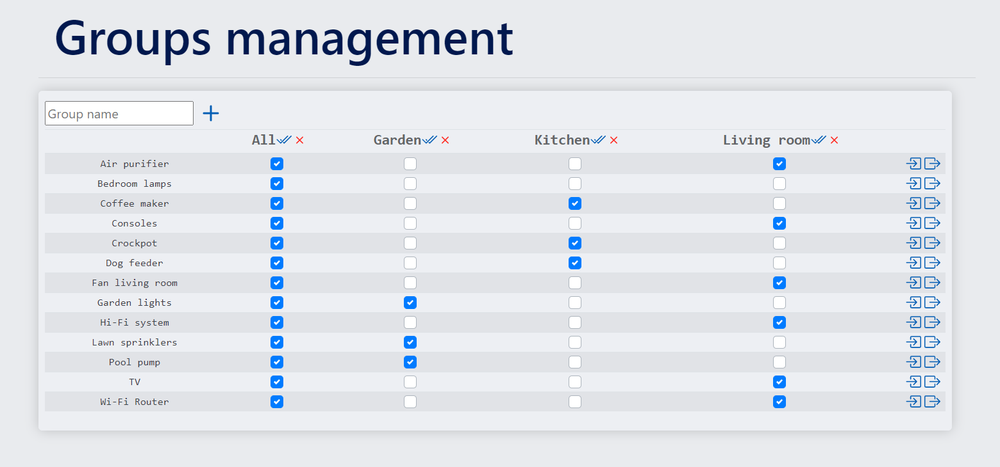

<h1 align = "center"> IoT Hub </h1>

<p align="center">
    
</p>

[![MIT License][license-shield]][license-url]
[![LinkedIn][linkedin-shield]][linkedin-url]

Deploy a server connected to an MQTT broker to control your Internet-of-Things devices through a Web App including, GUI, RESTful API, and an SQL database! Built with [Spring Boot](https://github.com/spring-projects/spring-boot), [Bootstrap 4](https://github.com/twbs/bootstrap), [Eclipse Paho Java Client](https://github.com/eclipse/paho.mqtt.java), and [SQLite JDBC Driver](https://github.com/xerial/sqlite-jdbc).

- [About The Project](#about-the-project)
  - [The Web-App](#the-web-app)
- [Getting Started](#getting-started)
  - [Prerequisites](#prerequisites)
  - [Installation](#installation)
  - [Launch the IoT-Hub](#launch-the-iot-hub)
- [Usage](#usage)
- [License](#license)

<!-- ABOUT THE PROJECT -->
## About The Project

### The Web-App

<p align="center">
    
</p>

<p align="center">
    
</p>

<!-- GETTING STARTED -->
## Getting Started

To get a local copy up and running follow these simple steps.

### Prerequisites

* Java JDK 8+
* Gradle 7+
* An MQTT broker, deploy the following docker container if unsure:
    ```sh
    docker pull eclipse-mosquitto:1.6.14
    docker run -it -p 1883:1883 eclipse-mosquitto:1.6.14
    ```

### Installation

You need an MQTT broker running on port `tcp://127.0.0.1:1883` to execute installation tests. 

1. Clone the repo.
   ```sh
   git clone https://github.com/ArthurFDLR/IoT_hub.git
   cd .\IoT_hub\
   ```
2. Run unitary tests and build the app.
   ```sh
   gradle
   ```
3. Run integration tests to verify installation, it may take some time.
   ```sh
   gradle test_integration
   ```

### Launch the IoT-Hub

1. Configure your IoT-Hub in [`./hubConfig.json`](./hubConfig.json):
   * `httpPort`: port on which the web-app and the RESTful API can be accessed.
   * `mqttBroker`: Address of your MQTT broker, should be `tcp://127.0.0.1:1883` if you followed the [prerequisites](#prerequisites) MQTT installation.
   * `mqttClientId`: Client ID used by the hub to connect to the broker.
   * `mqttTopicPrefix`: Prefix of all MQTT topics used by the web app.
   * `databaseFileName`: Name of the SQLite database for your hub.
2. Start the hub
   ```sh
   gradle iot_hub
   ```
3. You can simulate smart plugs to populate the MQTT server if you don't have any IoT devices connected. Configure the simulator in [`./simConfig.json`](./simConfig.json):
   * `httpPort`: port on which the simulated plugs can be controlled. It must be different from the port of the main web app.
   * `plugNames`: List of names of simulated plugs.
   * `mqttBroker`: Address of your MQTT broker.
   * `mqttClientId`: Client ID used by the simulator to connect to the broker.
   * `mqttTopicPrefix`: Prefix of all MQTT topics used by the simulator. It must be the same as the one used by the web app.

<!-- USAGE EXAMPLES -->
## Usage


<!-- LICENSE -->
## License

Distributed under the MIT License. See `LICENSE` for more information.

<!-- MARKDOWN LINKS & IMAGES -->
[license-shield]: https://img.shields.io/github/license/ArthurFDLR/IoT_hub.svg?style=for-the-badge
[license-url]: https://github.com/ArthurFDLR/IoT_hub/blob/master/LICENSE.txt
[linkedin-shield]: https://img.shields.io/badge/-LinkedIn-black.svg?style=for-the-badge&logo=linkedin&colorB=555
[linkedin-url]: https://linkedin.com/in/arthurfdlr/